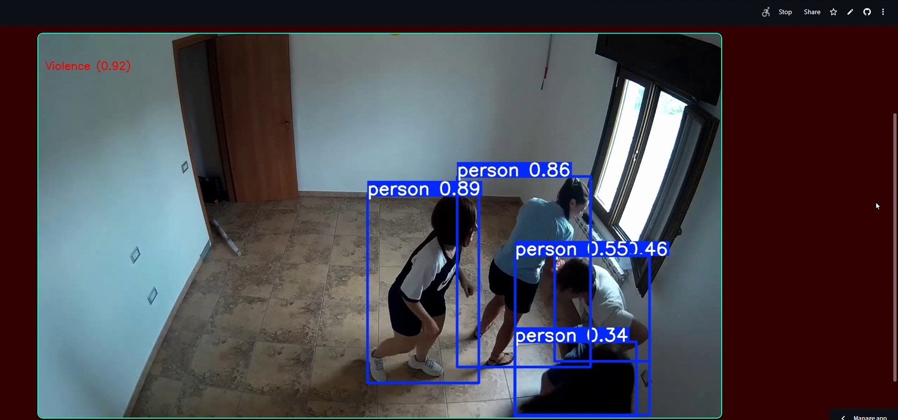

# Vigilant Eye👁 – Crowd & Violence Detection

## 🔍 Overview
**Vigilant Eye** is a real-time video analysis system that detects:
- **Crowds** – counts the number of people in a scene using YOLOv8  
- **Violent Acts** – classifies violent vs non-violent activity using a trained CNN model  
- **Buzzer Alerts** – triggers an alarm if **crowd size exceeds a threshold** and **violence is detected**

This project combines **Computer Vision (YOLOv8)** and **Deep Learning (Keras/TensorFlow)** into a single Streamlit app.  

---

## ✨ Features
- 📦 **Two-in-One Detection** – Crowd counting + violence recognition in one system  
- 📹 **Supports Pre-recorded Videos** – MP4, AVI, MOV  
- ⚠ **Configurable Crowd Threshold** – Default: 5 people  
- 🔊 **Buzzer Sound** – Plays alarm if both violence and crowd threshold conditions are met  
- 🖥 **Streamlit Web App** – Easy to run and interact with  
- 🖼 **Live Webcam Mode** *(local use only)* – Not supported online without TURN server  

---

## 🛠 Installation

```bash
# Clone repository
git clone https://github.com/Khubaib8281/SMART_CCTV.git
cd smartcctv

# Install dependencies
pip install -r requirements.txt
```

---

## 📂 Project Structure
```
📁 vigilant-eye
│-- app.py    # Main Streamlit app
|-- CROWD_DETECTOR.py   # Crowd detector app
│-- modelnew.h5              # Trained violence detection model
│-- yolov8n.pt                # YOLOv8 weights
│-- requirements.txt
│-- sample_video.mp4          # Example input video
│-- README.md
```    

---

## ▶️ Usage
### Run the main Streamlit App:
```bash
streamlit run app.py
```

### Using the App:
1. **Upload a video file** (`.mp4`, `.avi`, `.mov`)
2. App runs **crowd counting + violence detection**  
3. If violence is detected **and** crowd > threshold → buzzer sound plays

---

## 📊 Models Used
- **Crowd Detection** – [YOLOv8 Nano](https://github.com/ultralytics/ultralytics)  
- **Violence Detection** – Custom-trained CNN

---

## 🎥 Demo



---

## ⚠ Notes
- Webcam streaming in Streamlit requires a **TURN server** for online deployment  
- Violence detection accuracy depends on **training dataset quality**  
- Crowd counting works best in **clear, unobstructed scenes**

---

## 📜 License
MIT License © 2025 Muhammad Khubaib Ahmad
